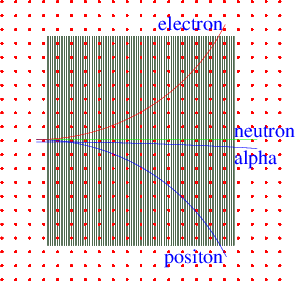
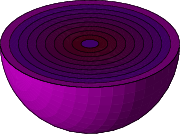

[](../../..)
[](../..)
[](..)
[](../#detector-construction)

## Create text geometry using SHELL script

[tracker.sh][] is an example shell script to create a [text geometry][tg] file `tracker.tg`, which is used in [bend.mac][].

```sh
$ ./tracker.sh # create tracker.tg
$ gears bend.mac # create tracker.png
```

You need to have [dawn][] installed to convert the output `g4_0000.prim` to `g4_0000.eps`, and to have [convert][] command available to convert `g4_0000.eps` to `tracker.png`:



[LINEAR_X.tg][] shows another way to create the same geometry. The problem of this approach is that the copy number cannot start with any number other than 0.

[onion.sh][] is an another example shell script to create a [text geometry][tg] file `onion.tg`, which is used in [onion.mac][].

```sh
$ ./onion.sh # create onion.tg
$ gears onion.mac # create onion.png
```

It demonstrate how to place a smaller solid directly inside a bigger one. The final result looks like this:



[tracker.sh]:{{site.file}}/examples/detector/scripts/tracker.sh
[bend.mac]:{{site.file}}/examples/detector/scripts/bend.mac
[tg]: {{site.g4doc}}/Detector/Geometry/geomASCII.html
[dawn]:https://geant4.kek.jp/~tanaka/DAWN/About_DAWN.html
[LINEAR_X.tg]:{{site.file}}/examples/detector/scripts/LINEAR_X.tg
[convert]:https://imagemagick.org/script/convert.php
[onion.sh]:{{site.file}}/example/detector/scripts/onion.sh
[onion.mac]:{{site.file}}/example/detector/scripts/onion.mac
