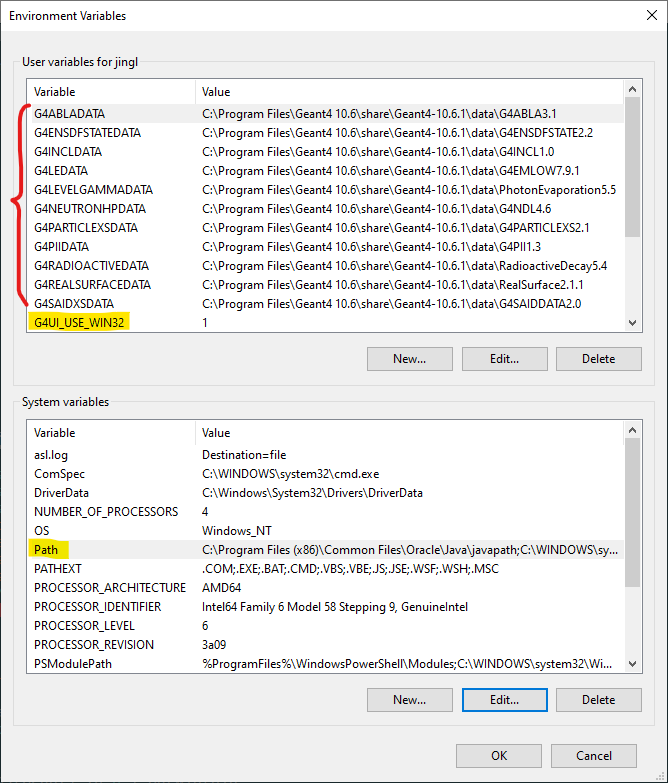
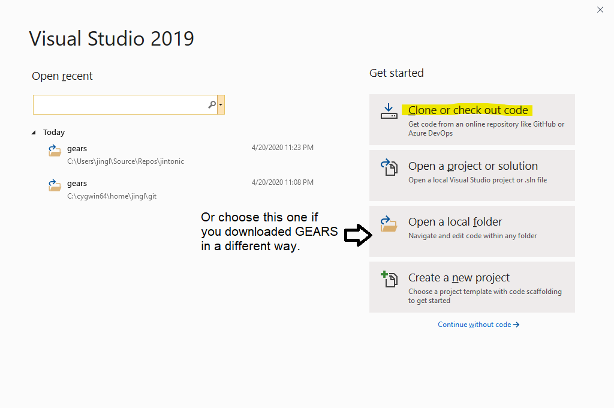
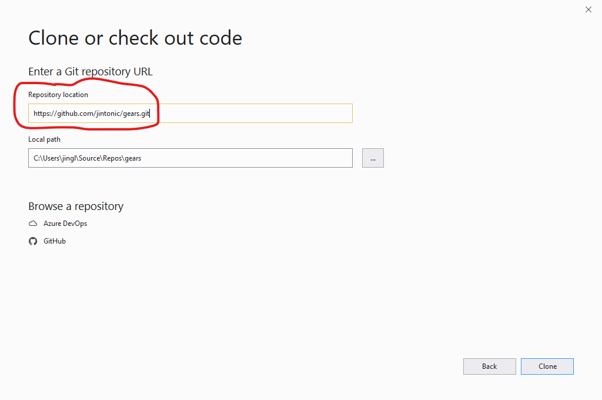
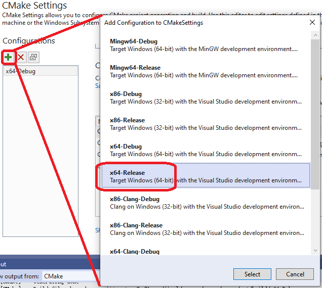
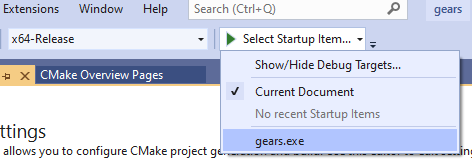
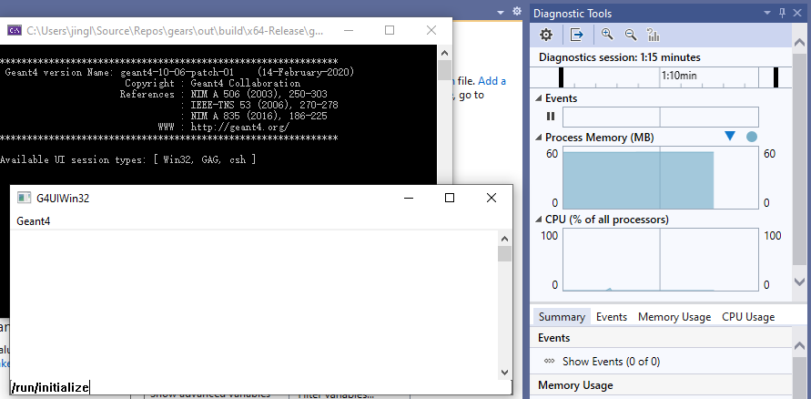

[](..)
[](#compile-gears)
[](#gears-usage)
[](#install-geant4)
[](#install-root)

[GEARS][] can run in three major operating systems: [Windows](#compile-gears-with-visual-studio), [macOS](#compile-gears-in-macos-and-linux), and [Linux](#compile-gears-in-macos-and-linux). If you already have [Geant4][] installed in your system, please jump directly to section [Compile GEARS](#compile-gears), and then [GEARS usage](#gears-usage).

[GEARS]: https://github.com/jintonic/gears
[Geant4]: http://geant4.cern.ch

# Prerequisites

* [Geant4][], version above 9 is requested due to the following inconvenience in version 9: <http://hypernews.slac.stanford.edu/HyperNews/geant4/get/hadronprocess/1242.html>.
* (Optional) [Xerces-C++](https://xerces.apache.org/xerces-c/), to use or export detector geometries in [GDML][] format.
* (Optional) [HDF5][], to save simulation results in [HDF5][] format.
* (Unnecessary) [ROOT][] is NOT needed to run [GEARS][] even though the default output file format is in [ROOT][].

[GDML]: https://gdml.web.cern.ch/GDML/
[HDF5]: https://www.hdfgroup.org/downloads/hdf5/
[ROOT]: https://root.cern.ch

## Install Geant4
The [Geant4 Installation Guide](https://geant4-userdoc.web.cern.ch/geant4-userdoc/UsersGuides/InstallationGuide/html/) is your ultimate reference should you have any issue regarding [Geant4][] installation. Covered here are detailed instructions on how to install pre-compiled [Geant4][] in [Windows](#install-pre-compiled-geant4-in-windows), [macOS](#install-pre-compiled-geant4-in-macos), and CentOS7(#install-pre-compiled-geant4-in-centos) to skip a long compilation of [Geant4][], which cannot be avoid if you use other OS or need features that are not included in the pre-compiled [Geant4][].

### Install pre-compiled Geant4 in Windows

Download pre-compiled Geant4 in Windows 10 from <https://geant4.web.cern.ch/support/download>. When you double click it to install it, Windows will pop a window "Windows protected your PC". Select "More info" and then "Run anyway". Now simply follow the instruction till the end, except for the following step, where you need to choose "Add Geant4 to the system PATH for all users" or "current user":


A few more steps need to be done before you can start to use your [Geant4][]. They are covered in the [Geant4 Installation Guide](http://geant4-userdoc.web.cern.ch/geant4-userdoc/UsersGuides/InstallationGuide/html/postinstall.html#required-environment-settings-on-windows). Basically, you need to download [Geant4][] data files from <http://geant4.web.cern.ch/support/download>, unpack them into a directory, for example, `C:\Program Files\Geant4 10.6\share\Geant4-10.6.1\data`, and then [set environment variables](http://geant4-userdoc.web.cern.ch/geant4-userdoc/UsersGuides/InstallationGuide/html/postinstall.html#required-environment-settings-on-windows) to point to the database directories. This is a very tedious process. You can download [a windows batch file](https://en.wikipedia.org/wiki/Batch_file), [GEARS/install/geant4.bat](geant4.bat), open it with `notepad`, modify its contents based on your Geant4 database locations, save and then double click it to run it. To check if it runs successfully, press the `windows` key on your keyboard, type `environment` and <kbd>Enter</kbd> to bring up the following window:


Click "Environment Variables..." and check the following highlighted items:



### Install pre-compiled Geant4 in macOS

You can download the pre-compiled Geant4 libraries for the macOS [here](https://geant4.web.cern.ch/support/download). By default, it will be saved to `~/Downloads`.

```sh
$ cd ~/Downloads/Geant4-10.6.1-Darwin/bin
# change location of geant4 databases
$ sed -i.bak 's|/Users/gcosmo/Software/release/install|'${HOME}'/Downloads/Geant4-10.6.1-Darwin|g' geant4-config
$ ./geant4-config --install-datasets
```

By default, macOS does not allow you to run Geant4 libraries in `~/Downloads/Geant4-10.6.1-Darwin/lib`. You have to follow the instruction [here](https://github.com/Jackett/Jackett/issues/5589) to make the exception:

```sh
$ cd ~/Downloads/Geant4-10.6.1-Darwin/lib
$ xattr -p com.apple.quarantine libG4run.dylib
0081;5e968234;Firefox;29504EDE-15EA-4CF5-A750-6B0AEB8CF5ED
# copy the output and change the first 4 letters from 0081 to 00c1:
$ xattr -w com.apple.quarantine "00c1;5e968234;Firefox;29504EDE-15EA-4CF5-A750-6B0AEB8CF5ED" libG3*.dylib
$ xattr -w com.apple.quarantine "00c1;5e968234;Firefox;29504EDE-15EA-4CF5-A750-6B0AEB8CF5ED" libG4*.dylib
```

Add the following to `~/.bash_profile`:

```sh
export G4SYSTEM=Darwin-clang
export G4INSTALL=~/Downloads/Geant4-10.6.1-Darwin
export PATH=$G4INSTALL/bin:$PATH
export DYLD_LIBRARY_PATH=$G4INSTALL/lib:$DYLD_LIBRARY_PATH
# source gears/gears.sh to export Geant4 database locations
source /path/to/gears/gears.sh
```

If you encounter problems to load some shared libraries when you run a Geant4 executable, for example, `libXmu.6.dylib`, check its location in `libG4OpenGL.dylib` using:

```sh
# print shared libraries used in a library file
$ otool -L libG4OpenGL.dylib
libG4OpenGL.dylib:
...
/opt/X11/lib/libXext.6.dylib (compatibility version 11.0.0, current version 11.0.0)
/opt/local/lib/libXmu.6.dylib (compatibility version 9.0.0, current version 9.0.0)
/opt/X11/lib/libGL.1.dylib (compatibility version 4.0.0, current version 4.0.0)
...
```

and then use the following trick to solve the problem:

```sh
# make a link in the location appeared in the library file
$ mkdir /opt/local/lib
$ cd /opt/local/lib
$ ln -sf /opt/X11/lib/libXmu.6.dylib
```

### Install pre-compiled Geant4 in CentOS

After an successful installation of [Geant4][], there should be a command line tool [geant4-config](http://geant4-userdoc.web.cern.ch/geant4-userdoc/UsersGuides/InstallationGuide/html/buildtools.html#other-unix-build-systems-geant4-config) available, which can be used to query some basic information of your [Geant4][] installation. [GEARS][] relies on it to find the installed [Geant4][] libraries and header files.Please run the following command to make sure that you have it available:

```sh
$ which geant4-config
```

If you get a null result, please contact the person who installed [Geant4][] in your system for help.

# Compile GEARS

## Get GEARS
You can download [GEARS][] as a `.tar.gz` or `.zip` file from its [homepage](http://physino.xyz/gears) or [GitHub page](https://github.com/jintonic/gears), and run the following to unzip it:

```sh
$ unzip gears-master.zip # if you downloaded the zip file
$ tar xfvz jintonic-gears-commitID.tar.gz # if you download the tar.gz file
$ mv jintonic-gears-commitID gears # rename the directory
```

If you know how to use [Git][], you can download the whole [GEARS repository from GitHub][GEARS]:

```sh
$ git clone https://github.com/jintonic/gears.git
```

This way, you can update your local copy from time to time using

```sh
$ cd /path/to/gears
$ git pull
```

Note that if you change some files in your local copy, the `git pull` command will fail since [Git][] does not want to overwrite your local modification with the updated [GEARS][]. To avoid this, please copy [example macros](examples) to somewhere outside of the `gears/` directory. You can then modify them as you like without worry. An easy way to check if there is any local change that may block `git pull` is:

```sh
# show modified files
$ git status
# show what are changed
$ git diff a/changed/local/file
# discard the local change
$ git checkout -- a/changed/local/file
# get latest gears
$ git pull
```
[Git]: https://en.wikipedia.org/wiki/Git

## Compilation

### Compile GEARS with Visual Studio

Download Visual Studio Community Edition installer. Run it. Choose to install a workload called "Desktop development with C++". It is about 2 GB and takes a long time to download and install. When you open VS the first time, choose "Visual C++" as your "Development Settings". And then "Clone and checkout code":











### Compile GEARS in macOS and Linux
[GEARS][] is shipped with a simple [makefile]({{site.file}}/makefile). Simply type `make` to compile [gears.cc]({{site.file}}/gears.cc) to generate a tiny executable `gears`:

```sh
$ cd /path/to/gears
$ make # compile gears.cc to generate executable: gears
$ source gears.sh # setup environment for using gears
$ gears # run gears in current terminal
```

You should also add the `source gears.sh` line to your `~/.bashrc` so that you can use `gears` in any newly opened terminal. For Mac users, you need to `source ~/.bashrc` in your `~/.bash_profile` in addition. Please check [this article](https://scriptingosx.com/2017/04/about-bash_profile-and-bashrc-on-macos/) for explanation.

## GEARS usage

### User interface

[GEARS][] relies on [G4UIExecutive]({{site.g4doc}}/GettingStarted/graphicalUserInterface.html#how-to-select-interface-in-your-applications) to select a user interface (UI). Without any specific setup, [GEARS][] will try to run a graphic user interface (GUI) based on [Qt][]. If your [Geant4][] is not compiled with [Qt][] support, [GEARS][] will try to [use a command-line UI that behaves like a tcsh]({{site.g4doc}}/GettingStarted/graphicalUserInterface.html#g4uiterminal). Run the following command to check if your [Geant4][] is compiled with [Qt][]

```sh
$ geant4-config --help | grep qt
```

If the output is `qt[yes]`, then you should be able to use the [Qt][] based GUI. If you can't, please check if you set the environment variable `G4UI_USE_TCSH` somewhere:

```sh
$ env |grep G4UI
```

If yes, run `export G4UI_USE_QT=1` to overwrite the `G4UI_USE_TCSH` setting, and run `gears` again. It is optional to delete the latter, because if both variables are set, the latter will be ignored.

Now, if you want to go back to the command-line UI, you need to `unset G4UI_USE_QT` and keep the `G4UI_USE_TCSH` setting unchanged. `export G4UI_USE_QT=0` or `export G4UI_USE_QT=false` does not do what you intend to do. In fact, you can set `G4UI_USE_QT` to any value. It will take effect as long as it is not empty. The only way to completely get rid of it is to `unset` it.

If none of the environment variables is set, you can use `~/.g4session` to select your UI:

```sh
qt # the first line is for all Geant4 applications
gears tcsh # just for gears
```

[Qt]: https://doc.qt.io/

### Session mode

Without any argument, `gears` will start an [interactive session]({{site.g4doc}}/GettingStarted/graphicalUserInterface.html). It accepts [commands]({{site.g4doc}}/Control/commands.html) you type in the UI.

You can also put a set of commands into a [macro](examples) file, which can be used as an argument of `gears`. For example,

```sh
$ cd gears/examples/detector/visualization
$ gears RayTracer.mac # run gears in batch mode
```

This way, `gears` will run in the batch mode. It executes commands in the macro file one by one, and quit once it finishes.

## Install ROOT
### Install pre-compiled ROOT in Windows
Some [manual modifications](https://root-forum.cern.ch/t/windows-install-issue-with-root-version-618-02/35773/7) have to be done after installing pre-compiled ROOT in version 6. If you don't mind, install version 5 instead. It works out of box. Old ROOT releases can be found at <https://root.cern.ch/releases>. In the installation, please don't forget to make the following choice:


### Install pre-compiled ROOT in macOS

Download pre-compiled ROOT for macOS from <https://root.cern.ch/downloading-root>. If you download the `.pkg` version, simply double click on the file to install it to `/Applications/` directory and then add the following to your `~/.bash_profile` (or `~/.zshrc` if you use `zsh`):

```sh
export ROOTSYS=/Applications/root_v6.20.04
export PATH=$ROOTSYS/bin:$PATH
export DYLD_LIBRARY_PATH=$ROOTSYS/lib:$DYLD_LIBRARY_PATH
```

